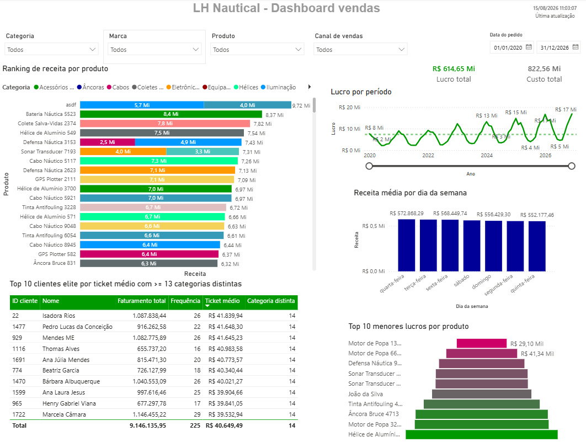

# Project LH Nautical - Indicium AI's Lighthouse Program

### Project overview

> A Continuous improvement project developed as part of the selection process for Indicium AI's Lighthouse Program, based on a fictional e-commerce case for LH Nautical. The project involved data analysis, identification of improvement opportunities, and the application of continuous improvement concepts to support decision-making, using Python, Power BI and SQL.

> Attention! Please note that this notebook is partially written in Brazilian Portuguese, as it was developed as a test project to evaluate my skills as part of the Indicium AI program selection process.

### Status & improvements

Completed [approved]

- [x] Question 1 - notebooks/main_analyses.ipynb -> data/orders.db
- [x] Question 2 - notebooks/schemas.ipynb -> sql_scripts/schemas.sql
- [x] Question 3 - notebooks/load.ipynb
- [x] Question 4 - sql_scripts/customer_analysis.sql
- [x] Question 5 - sql_scripts/calendar_dimension.sql
- [x] Question 6 - notebooks/demand.ipynb
- [x] Question 7 - notebooks/recomendation.ipynb
- [x] Final Question - dashboards/dashboard_LH_Nautical.pbix

### Prerequisites & used softwares

- WSL Linux/Ubuntu for Windows 11 System
- Python version 3.12.13
- PostgreSQL version 18.6
- Power BI version 2.157.879

> Attention! Consult the requirements.txt file for more information about python libraries used.

### Collaborators

<table>
  <tr>
    <td align="center">
      <a href="https://github.com/luiz-ed-ferreira" title="Luiz Eduardo">
         
        
          <b>Luiz Eduardo</b>
        
      </a>
    </td>
</table>
